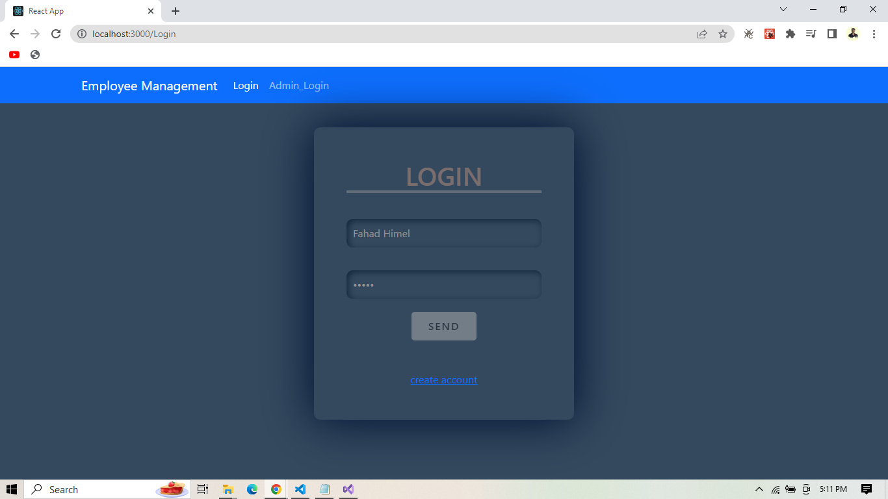
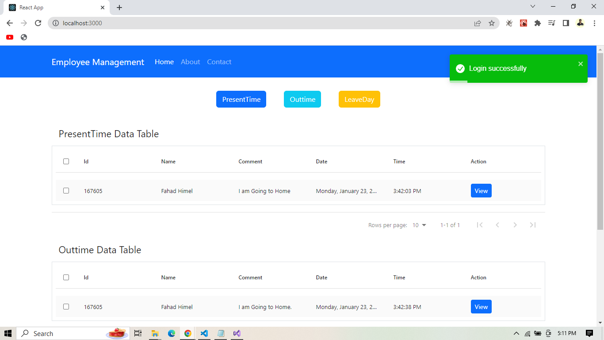
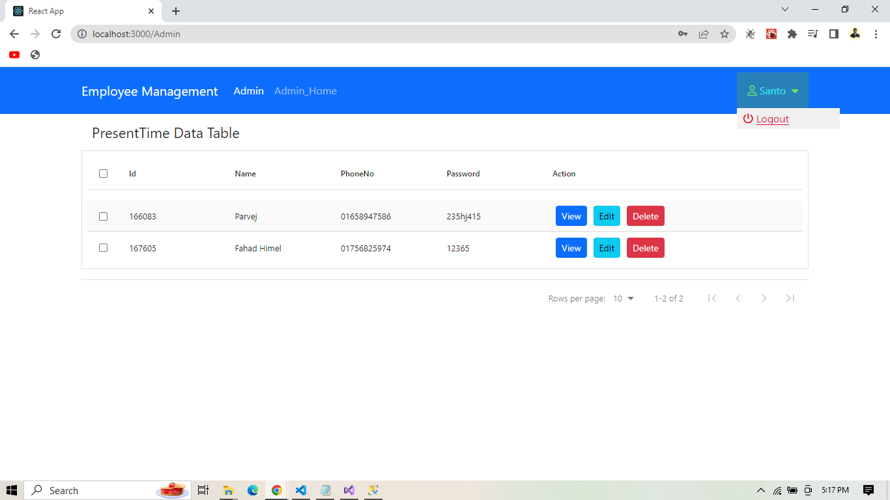

# Employee-Time-Schedule

With the help of this project we can keep accurate records of an employee's arrival, departure time or working day. And an admin can control all users

# Project images

# User images

 User image 1//
 
 

 User image 2//
 
 

 User image 3//
 
 

 User image 4//
 
 

 User image 5//
 
 

 User image 6//
 
 

# Admin images

 Admin image 1//
 
 
 
  Admin image 2//
 
 
 
  Admin image 3//
 
 
 
  Admin image 4//
 
 
 
  Admin image 5//
 
 
 
  Admin image 6//
 
 
 
  Admin image 7//
 
 
